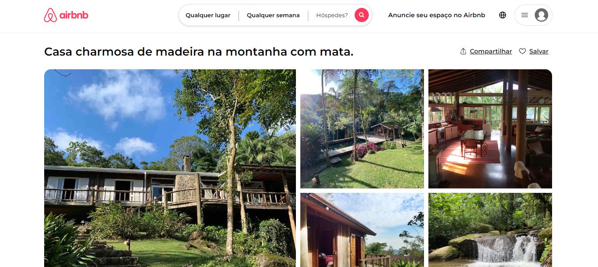

# INTEGRANTES
- **Guilherme Santos Nunes** | 558989
- **Kaique Rodrigues Zaffarani** | 556677
- **Kairo da Silva Silvestre de Carvalho** | 558288
- **Rafael Menezes Viana** | 558287

## LINKS
- **[ANÚNCIO](https://www.airbnb.com.br/rooms/43811303?source_impression_id=p3_1725563193_P3JqSKx1Z7hlryIk&check_in=2024-10-01&guests=1&adults=1&check_out=2024-10-06)**

- **[SITE](https://z4ffarani-educational.github.io/SEM2-CP2-FRONT-END-DESIGN/)**

<br>

# PROJETO
Este projeto consiste na criação de um site que replica uma página de anúncio do site **[Airbnb](https://www.airbnb.com.br)** utilizando tecnologias de Front-end. O site é totalmente responsivo, com uma experiência otimizada para variados dispositivos. A troca entre esses arquivos é feita dinamicamente com o uso de JavaScript, proporcionando uma transição suave e intuitiva.

Foram criados dois arquivos para o site:

- `index.html` | Arquivo principal para a versão de computador do site (Desktop). Contém a estrutura de layout e elementos voltados para telas maiores, como de tablets e notebooks.

- `mobile.html` | Arquivo dedicado à versão de celular do site (Mobile). Possui uma estrutura simplificada e adaptada para telas menores, garantindo dinamismo, usabilidade e performance.
  
<br>

# INSTRUÇÕES
1. Em um terminal, clonar o repositório:
```bash
git clone https://github.com/Z4FFARANI-EDUCATIONAL/SEM2-CP2-FRONT-END-DESIGN.git
```

2. No terminal, navegar até a pasta do projeto:
```bash
cd SEM2-CP2-FRONT-END-DESIGN/docs
```

3. Acessar o site executando o arquivo: `index.html`, ou o arquivo: `mobile.html`

<br>

# FUNÇÕES

**`index.html`** e **`mobile.html`**:
- **Escutador de evento** | Utilizado para detectar a proporção da tela e alternar entre os arquivos HTML de acordo com o tamanho da janela do navegador. A função JavaScript `addEventListener` monitora o evento de redimensionamento (`resize`) e, ao identificar uma mudança de Breakpoint, carrega o arquivo correspondente, proporcionando uma experiência de navegação adequada a cada dispositivo.

- **API para correspondência de tela** | A API do JavaScript `matchMedia` verifica quando a largura da tela atinge um Breakpoint específico. Quando um Breakpoint é identificado, o `script` carrega o arquivo HTML apropriado para garantir a melhor experiência de visualização para o usuário.

- **Elementos Gráficos em SVG** | Foram utilizados ícones e gráficos no formato SVG (Scalable Vector Graphics) para garantir uma alta qualidade visual em qualquer resolução de tela. SVGs são ideais para elementos como logos, ícones e gráficos que precisam ser escalonáveis e leves. Eles são embutidos diretamente nos arquivos HTML para facilitar o controle de estilos e animações através do CSS e JavaScript.

<br>

**`index.css`** e **`mobile.css`**:
- **Media Queries** | Utilizadas para definir estilos específicos para diferentes tamanhos de tela. Isso assegura que o layout e os elementos da página se adaptem adequadamente a dispositivos de várias dimensões, oferecendo uma experiência de usuário consistente.

- **Breakpoints** | Os Breakpoints foram definidos para diferenciar entre versão Desktop e Mobile, garantindo que as Media Queries e o JavaScript funcionem em conjunto para alterar o layout quando a largura da tela ultrapassa ou fica abaixo de um determinado valor.

- **Unidades relativas** | Foram usadas unidades relativas como `rem` (para tamanhos de fonte e espaçamentos) e `vh` (altura da viewport) para criar um layout mais flexível e adaptável ao tamanho da tela do usuário.

<br>

# OBSERVAÇÕES
- Para que o JavaScript consiga alternar entre os arquivos HTML corretamente, é necessário ajustar a barra de Breakpoint do inspetor de elementos do navegador de forma lenta e gradual. Mudanças rápidas podem impedir a execução precisa do `script`, especialmente quando se trata de transições em Breakpoints próximos.
- Os elementos de interação da página, como botões, links, mapas e calendários, não são totalmente fiéis ou funcionais e servem apenas a fins estéticos.
- Todos os direitos de marca são reservados ao Airbnb, não havendo qualquer parceria direta com este projeto.
- Foi solicitado o direito de uso de imagem tanto do anúncio quanto do anunciante.

<br>

# TECNOLOGIAS
[](https://developer.mozilla.org/pt-BR/docs/Web/HTML)
[](https://developer.mozilla.org/pt-BR/docs/Web/CSS)
[](https://developer.mozilla.org/pt-BR/docs/Web/JavaScript)

<br>

# AGRADECIMENTOS
- **[Alexandre Russi Junior](https://github.com/alexandrerussi)**
